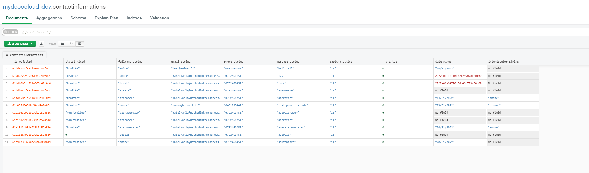

Projet de fin de d'année FSD06
===============

Home
---------------
Le dossier App.home contient le code de intégralité du Template du site web dans la partie "front-pages/components", une requête ce trouve dans la partie "containers/home"

Admin
-------------
le dossier App.admin contient une partie du backoffice 

BDD
-------------
Pour la BDD vous trouverez le schéma MongoDb dans "projects\lib.node.decocloud\models\contact-information\contact-Information.mongoose.ts"

